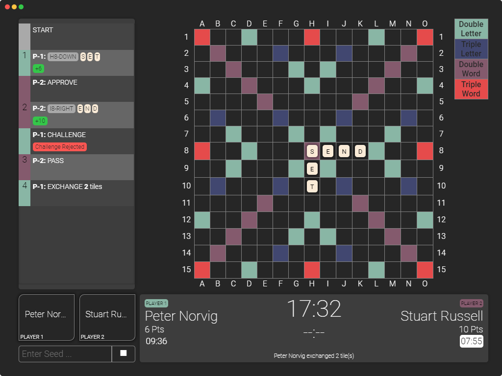

# Scrabble-Server

> Scrabble Server is a 2-Player Websockets Scrabble Judging Server. This project is made for the Spring 2019 Machine Intelligence Course (CMPN402) (Previously for CMPN402/CMP402A Fall 2018) in Computer Engineering Program at Cairo University Faculty of Engineering.

The server uses Websockets protocol version 13 as defined by RFC6455 (https://tools.ietf.org/html/rfc6455)

Communication Details can found in [this document](docs/protocol.pdf).

**WARNING:** When running the server, place it in a folder where it has permission to create folders and write files. This permission is needed to save logs and checkpoints.

## How to run and build

### Before running or packaging the server:

- To install the dependencies, run: `npm install`.
- To build the renderer, run: `npm run production` (See [Laravel Mix](https://laravel.com/docs/5.7/mix#running-mix) for more options).

### To run the server or an example:

- To run the server, run: `npm run start`.
- To test scrabble game only, run: `node ./examples/console-scrabble.js [seed]`.
- To run the console client, run: `node ./examples/client.js [name] [port=8080] [host=127.0.0.1]`.

### Additional Options

- To run tests, run: `npm run test`.
- To package the server for distribution, run: `npm run dist`.
- To package the console client into an exe, run: `npm run pack-client`.

## Configuration

Server configuration is found in `config.json`, which contains the following configurations:

- `host`: can be `127.0.0.1` if the server and the client are on the same machine (useful for debugging) and must be `0.0.0.0` if the clients will run on a seperate machine (**NOTE:** you can get your machine's ip on the local network using `ipconfig`).
- `port`: defines the port to which the server will listen.
- `ping interval`: defines the time interval for the ping/pong handshake in the heartbeat system (Format: `MM:ss.s`).
- `rack size`: defines the rack size for each player (currently must be 7).
- `bingo`: defines the bingo bonus points (should be 50 in a standard game).
- `penalize remaining tiles`: determines whether to penalize player remaining tiles in rack at the game end or not.
- `design`: defines the board design. It is a 2D Array which contains the type of each square (currently, the array size must be 15x15). The square types can be:
	- `0` - Normal Square.
	- `1` - Double Letter Square.
	- `2` - Triple Letter Square.
	- `3` - Double Word Square.
	- `4` - Triple Word Square.
- `tile scores`: is a dictionary that defines the score of each tile.
- `tile frequencies`: is a dictionary that defines how many tiles of each letter will appear in the bag.
- `starting timespans`: defines the starting time for each player (Format: `MM:ss.s`).
- `challenge timespan`: defines the timespan allowed for a player to challenge the opponent's move.
- `penalty`: defines how the penalty is calculated and contains:
	- `points`: defines the points deducted for every used **unit** for over-time (should be 10 in a standard game).
	- `every`: defines the time **unit** used to calculate penalty (should be 1 minute in a standard game) (Format: `MM:ss.s`).
- `dictionary`: defines the relative path to the word list file. The word list should contain only words separated by newline characters.

## How to use the Server

After running the server, run 2 clients then press *Play*. If there is a saved checkpoint, you can press *Pause* to start from checkpoint or *Restart* to start from seed. If you press *Stop*, you can continue the game later.

## How to use the Console Client

Run: `node ./examples/client.js [name] [port=8080] [host=127.0.0.1]`. If the client and server are on the same device, you can use the default host (`127.0.0.1`). Otherwise, you need to find the Server IP by running `ipconfig` on the host machine. 

The client can play their turn using on of the following commands:

- `PASS`
- `EXCHANGE [Tiles]` where:
	- `Tiles` must contain at least one tile and each tile is written in Uppercase and blanks is written as an underscore.
- `PLAY [Column] [Row] [Direction] [Tiles] [Score]` where:
	- `Column` and `Row` is where to put the first tile. `Column` can be a letter from **A** to **O** and `Row` can be a number from **1** to **15**.
	- `Direction` defines where the remaining tiles will be placed relative to the first tile and it can **R** for Right or **D** for Down.
	- `Tiles` are the placed tile and can be a letter from **A-Z** (or **a-z** if the tile is originally a blank).
	- `Score` is the number of points gathered by this move.

The client must also reply to the opponent's play with one of the following commands:

- `OK` to approve his move.
- `CHALLENGE` to challenge his move.
- If the challenge period ends before you send a reply, it will be considered an approval.

## License
The project is available as open source under the terms of the [MIT License](LICENSE).
